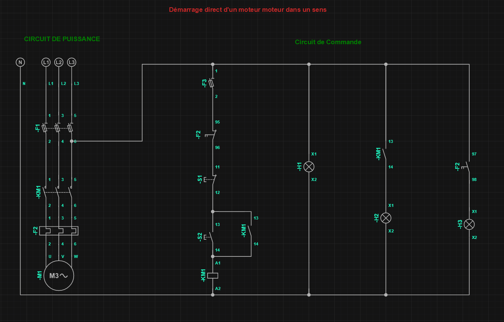
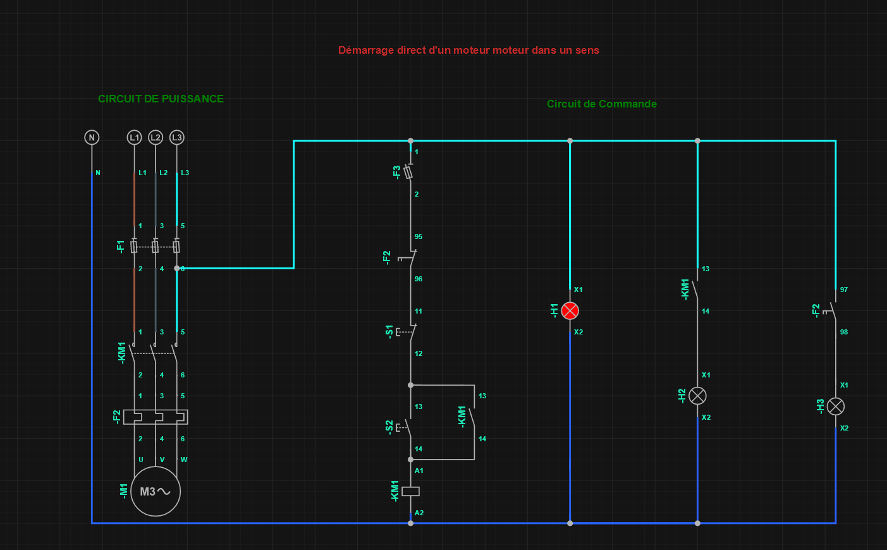
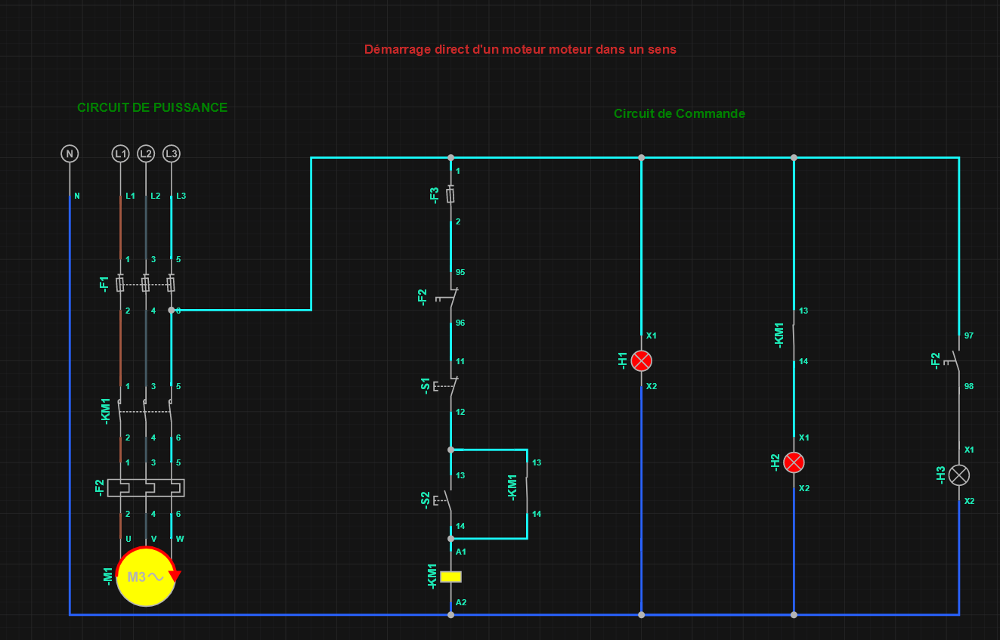
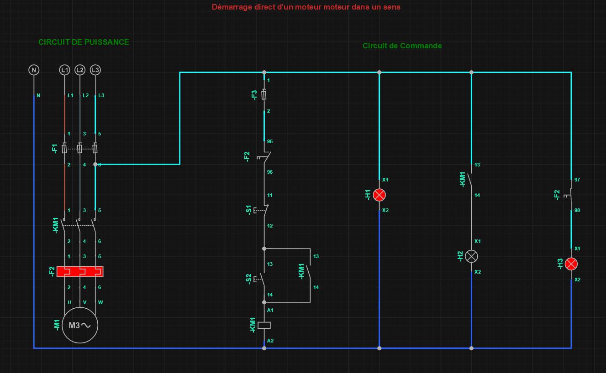

## Objectif

Ce projet présente la réalisation et la simulation d'un circuit de démarrage direct d'un moteur triphasé dans un seul sens de rotation.

Le schéma a été réalisé avec le logiciel **SIMURELAY**.

## Schéma électrique

## Circuit de puissance

Le circuit de puissance comprend :
- une alimentation triphasée L1, L2 et L3 ;
- des fusibles de protection ;
- un contacteur KM1 ;
- un relais thermique F2 ;
- un moteur triphasé M1.

## Circuit de commande

Le circuit de commande comprend :
- un bouton d'arrêt S1 ;
- un bouton de marche S2 ;
- la bobine du contacteur KM1 Que lorsqu'il est excité permet de changé l'état des contacteurs auxiliaires ;
- un contact auxiliaire KM1 (13-14) assurant l'auto-maintient ;
- des voyants de signalisation (H1,H2 et H3).

## Fonctionnement

Lorsque le bouton S2 est actionné, la bobine KM1 est alimentée. Le contacteur ferme ses contacts de puissance et alimente le moteur.

Le contact auxiliaire KM1 (13-14) assure l'auto-maintient de la bobine après le relâchement du bouton S2.

Lorsque S1 est actionné, le circuit de commande est interrompu, KM1 retombe et le moteur s'arrête.

En cas de surcharge, le relais thermique F2 ouvre son contact 95-96 afin de couper la commande du contacteur.

## Simulation
### Mise sous tension
Lorsque le sectionneur est placé à l’état 1 (fermé), le circuit de commande est alimenté et le voyant H1 s’allume, indiquant la présence de tension.

### Démarrage
Appui sur S2 → KM1 s'active → moteur démarre → H2 s'allume : moteur en fonctionnement.

## Présence d'une surcharge 
Déclenchement du relais thermique F2 → contact 95-96 s'ouvre → moteur s'arrête → contact 97-98 se ferme → H3 s'allume : défaut/surcharge moteur.

## Fichiers du projet

- schéma_electrique.png : schéma électrique, demarrage, mise sous tension
- démarrage_direct_un_sens.smrl : fichier source SIMURELAY
